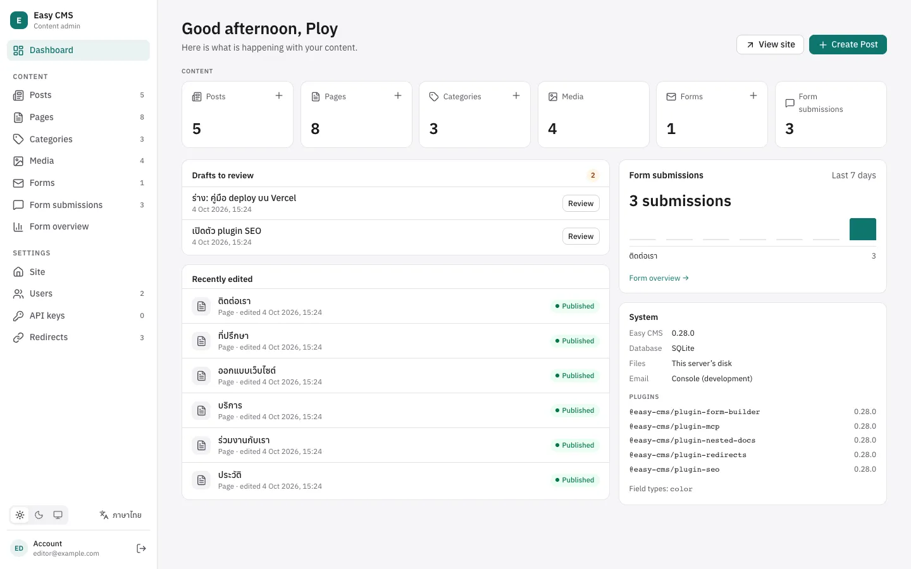

<div align="center">


# Easy CMS

**The embedded, code-first headless CMS for Nuxt and Next.js.**

A headless CMS that lives inside your Nuxt or Next.js app: the content model is TypeScript in
your repository, the admin and APIs come with it, and there is no extra server to run.

[](https://www.npmjs.com/package/@easy-cms/core)
[](https://github.com/maritonx/easy-cms/actions/workflows/ci.yml)
[](https://maritonx.github.io/easy-cms/)
[](https://nodejs.org)
[](LICENSE)

[Documentation](https://maritonx.github.io/easy-cms/) ·
[เอกสารภาษาไทย](https://maritonx.github.io/easy-cms/th/) ·
[Getting started](https://maritonx.github.io/easy-cms/guide/getting-started) ·
[Examples](#examples) ·
[Sponsor](https://github.com/sponsors/maritonx)

[](https://vercel.com/new/clone?repository-url=https%3A%2F%2Fgithub.com%2Fmaritonx%2Feasy-cms%2Ftree%2Fmain%2Ftemplates%2Fnext-starter&project-name=easy-cms&repository-name=easy-cms&env=EASY_CMS_SETUP_CODE&envDescription=A+code+you+choose%3A+you+type+it+to+create+the+first+admin+at+%2Fadmin&envLink=https%3A%2F%2Fmaritonx.github.io%2Feasy-cms%2Fguide%2Fone-click-deploy&stores=%5B%7B%22type%22%3A%22integration%22%2C%22integrationSlug%22%3A%22neon%22%2C%22productSlug%22%3A%22neon%22%2C%22protocol%22%3A%22storage%22%7D%2C%7B%22type%22%3A%22blob%22%2C%22access%22%3A%22public%22%7D%5D)
[](https://app.netlify.com/start/deploy?repository=https://github.com/maritonx/easy-cms&create_from_path=templates/next-starter)

</div>

<picture>
  <source media="(prefers-color-scheme: dark)" srcset="website/public/screenshots/dashboard-en-dark.webp">
  
</picture>

## Why Easy CMS

- **Runs inside your app.** A Nuxt module or Next.js route handlers add the admin at `/admin` and
  the API at `/api/cms`. One deployment, one database (yours, with prefixed tables).
- **Code-first and typed.** Collections, fields and access rules are TypeScript. The Local API
  infers document types from the config, so queries are typed without a build step.
- **Any frontend, too.** Using Vite, React, Vue, a mobile app or a static site? Run the same CMS
  as a [standalone server](https://maritonx.github.io/easy-cms/guide/standalone) and use its REST
  API.
- **An admin editors like**, in English and Thai: drafts, version history, live preview,
  scheduled publishing, blocks, translations, a media library and a light and dark theme.
- **Official plugins** for SEO, forms, redirects, nested pages, GraphQL, several sites in one CMS (multi-tenant) and AI assistants (MCP).

> [!NOTE]
> Easy CMS is pre-1.0: the API may change between minor versions. Each release lists its changes in
> the [changelog](packages/core/CHANGELOG.md); see
> [Backups & upgrades](https://maritonx.github.io/easy-cms/guide/backups) before upgrading.

## Quick start

To try it without installing anything, use the **Deploy** buttons above: a blog with its admin on
Vercel or Netlify, with a database and file storage made for you
([one-click deploy](https://maritonx.github.io/easy-cms/guide/one-click-deploy)).

In a Nuxt 4 or Next.js 15+ project:

```bash
npm create easy-cms@latest     # or: pnpm create easy-cms · yarn create easy-cms · bun create easy-cms
npm run dev                    # then open http://localhost:3000/admin
```

`create-easy-cms` installs the packages with your package manager, writes `easy-cms.config.ts`
with a sample collection and a secret in `.env`, and wires up the framework. Describe your
content in the config:

```ts
// easy-cms.config.ts
import { defineConfig } from '@easy-cms/core'
import { sqlite } from '@easy-cms/db-sqlite'

export default defineConfig({
  secret: process.env.EASY_CMS_SECRET!,
  db: sqlite({ url: 'file:./cms.db' }),
  collections: [
    {
      slug: 'posts',
      drafts: true,
      fields: [
        { name: 'title', type: 'text', required: true },
        { name: 'slug', type: 'slug', from: 'title' },
        { name: 'body', type: 'richText' },
      ],
    },
  ],
})
```

Then read it in your pages, fully typed:

```ts
// Nuxt: server/api/posts.get.ts
export default defineEventHandler(async () => {
  const cms = await useEasyCMS()
  return cms.find('posts', { where: { status: { equals: 'published' } } })
})
```

Next.js uses `getEasyCMS(config)` in Server Components; any other client uses REST at
`/api/cms/posts`.

**No Nuxt or Next.js?** Run the same command in an empty directory to get a standalone server:

```bash
npm create easy-cms@latest my-cms
cd my-cms && npm run dev       # http://localhost:4000/admin
```

## Features

**Content modeling**
- 15 field types: text, rich text (Tiptap), number, date, select, relationship, upload, array,
  group, blocks, JSON and more, with validation and per-field access
- Uploads with several files and drag-to-order (galleries), limited to the file types you allow:
  images, PDF, Word, Excel, PowerPoint, OpenDocument, CSV, audio, video and zip, detected from
  their contents
- Collections and globals, drafts and publishing, hooks
- Localization: one value per language, translation status in the lists
- Version history with restore, and drafts kept apart from the published version

**Admin**
- Lists with search, filters, columns, bulk actions and tree views; forms with a side panel
- Live preview of unsaved changes on your real pages
- Scheduled publish and unpublish
- A media library with folders (and who may use each), many files uploaded at once with their
  progress, icons by file type, a grid view, and previews: images, audio and video players, PDFs,
  text and CSV
- A dashboard that tells admins what needs attention: failed webhooks, stuck emails, late
  scheduled publishing
- Roles from the admin: tick what each role may do per collection, page and field, or on its own
  documents only, no code
- An audit log of who changed which fields, sign-ins and admin actions, signed against tampering
- English and Thai interface, light and dark themes, works on phones

**APIs**
- Typed Local API (fields that plugins add included), REST API with `where` queries, a GraphQL
  API (plugin), and generated types for frontends in other repositories
- Users and roles, function-based access rules per collection, document and field; forgotten
  passwords and invitations by email; single sign-on with Google, Microsoft, GitHub or any OpenID
  Connect provider
- API keys with per-collection permissions, signed webhooks with retries, email with retries

**Data and operations**
- SQLite (libSQL) or Postgres (postgres.js or PGlite) through Drizzle
- Schema push in development, reviewed migration files in production
- Uploads on disk, S3, Cloudflare R2, MinIO, Vercel Blob or Netlify Blobs, also from links (the
  server downloads them)
- One-click deploy to Vercel or Netlify, with a database and file storage
- Database backups on a schedule or by hand from the admin, downloadable
- `easy-cms` CLI: migrations, backups, copying between databases, scheduled jobs

**SEO and AI**
- Meta fields with a search preview, sitemaps, robots.txt, hreflang and JSON-LD
- `llms.txt`, Markdown versions of pages and AI crawler rules
- An MCP server so AI assistants can read and draft content with a limited API key

## Official plugins

| Plugin | What it adds | Guide |
|---|---|---|
| [`@easy-cms/plugin-seo`](packages/plugin-seo) | Meta fields, search preview, sitemap, robots.txt, structured data, llms.txt | [SEO](https://maritonx.github.io/easy-cms/guide/seo) |
| [`@easy-cms/plugin-form-builder`](packages/plugin-form-builder) | Forms built in the admin, submissions with an overview and a dashboard panel, email notifications, spam protection, `<easy-form>` | [Forms](https://maritonx.github.io/easy-cms/guide/forms) |
| [`@easy-cms/plugin-redirects`](packages/plugin-redirects) | Redirects managed in the admin, automatic redirects when a page moves | [Redirects](https://maritonx.github.io/easy-cms/guide/redirects) |
| [`@easy-cms/plugin-nested-docs`](packages/plugin-nested-docs) | Pages inside pages: parents, full paths, breadcrumbs, a tree in the admin | [Nested pages](https://maritonx.github.io/easy-cms/guide/nested-docs) |
| [`@easy-cms/plugin-graphql`](packages/plugin-graphql) | GraphQL API: queries and mutations for every collection and global, with your access rules | [GraphQL](https://maritonx.github.io/easy-cms/guide/graphql) |
| [`@easy-cms/plugin-mcp`](packages/plugin-mcp) | Model Context Protocol server for AI assistants | [MCP](https://maritonx.github.io/easy-cms/guide/mcp) |
| [`@easy-cms/plugin-multi-tenant`](packages/plugin-multi-tenant) | Several sites or clients in one CMS: content, members, roles and settings per tenant, a tenant switcher | [Multi-tenant](https://maritonx.github.io/easy-cms/guide/multi-tenant) |

Plugins are functions over your config: write your own with fields, endpoints, admin components,
admin pages, dashboard panels and CLI commands. See [Plugins](https://maritonx.github.io/easy-cms/guide/plugins). Packages can
also add field types, such as `color` from [`@easy-cms/fields`](packages/fields): see
[Custom field types](https://maritonx.github.io/easy-cms/guide/field-types).

## Packages

<details>
<summary>All packages (they share one version)</summary>

| Package | |
|---|---|
| [`@easy-cms/core`](packages/core) | Config, Local API, REST handler, auth, access control, hooks, localization, versions, webhooks |
| [`@easy-cms/nuxt`](packages/nuxt) | Nuxt 4 module: REST API, admin, typed `useEasyCMS()` |
| [`@easy-cms/next`](packages/next) | Next.js adapter: route handlers, typed `getEasyCMS()` |
| [`easy-cms`](packages/cli) | CLI: migrations, types, users, backups, standalone `serve` |
| [`create-easy-cms`](packages/create-easy-cms) | Adds Easy CMS to a project, or creates a standalone server |
| [`@easy-cms/db-sqlite`](packages/db-sqlite) | SQLite / libSQL database adapter |
| [`@easy-cms/db-postgres`](packages/db-postgres) | Postgres adapter (postgres.js or PGlite) |
| [`@easy-cms/storage-s3`](packages/storage-s3) | Uploads on S3, Cloudflare R2 or MinIO |
| [`@easy-cms/storage-vercel-blob`](packages/storage-vercel-blob) | Uploads on Vercel Blob |
| [`@easy-cms/storage-netlify-blobs`](packages/storage-netlify-blobs) | Uploads on Netlify Blobs |
| [`@easy-cms/email-smtp`](packages/email-smtp) | Email over SMTP |
| [`@easy-cms/auth-oauth`](packages/auth-oauth) | Single sign-on: Google, Microsoft, GitHub, OpenID Connect |
| [`@easy-cms/richtext`](packages/richtext) | Rich text to safe HTML or Markdown |
| [`@easy-cms/fields`](packages/fields) | More field types: `color`, with a picker and swatches |
| [`@easy-cms/admin`](packages/admin) | The admin UI (installed by the adapters) |
| [`@easy-cms/drizzle`](packages/drizzle) | Shared database layer (installed by the database adapters) |

</details>

## Examples

| Example | |
|---|---|
| [`examples/nuxt-blog`](examples/nuxt-blog) | Nuxt 4 blog on SQLite, with every official plugin |
| [`examples/next-blog`](examples/next-blog) | Next.js 16 blog on Postgres (PGlite locally) |
| [`examples/standalone`](examples/standalone) | Standalone server with a plain HTML frontend on another origin |

## Requirements

- Node.js 22.12 or later
- Nuxt 4, Next.js 15 or later (App Router), or no framework (standalone)
- SQLite or Postgres
- npm, pnpm, Yarn (node-modules) or Bun to install

## Contributing

Issues and pull requests are welcome. [CONTRIBUTING.md](CONTRIBUTING.md) explains how to build,
test and propose changes; [docs/DESIGN.md](docs/DESIGN.md) and the
[architecture decisions](docs/adr) explain why things are the way they are.

Please report security issues privately, as described in [SECURITY.md](SECURITY.md).

## Sponsors

Easy CMS is built in spare time. If it saves you or your team time, consider
[sponsoring its development](https://github.com/sponsors/maritonx): sponsorship pays for the work
toward 1.0, docs (in English and Thai) and faster fixes. Sponsors at $5 a month or more are
listed here, and company sponsors also get their logo on [easy-cms.io](https://easy-cms.io).

[](https://github.com/sponsors/maritonx)

### Founding sponsors

The first 10 sponsors, at any tier, are listed here permanently, even if they stop sponsoring
later. Spots left: 10 of 10.

## License

[MIT](LICENSE)
